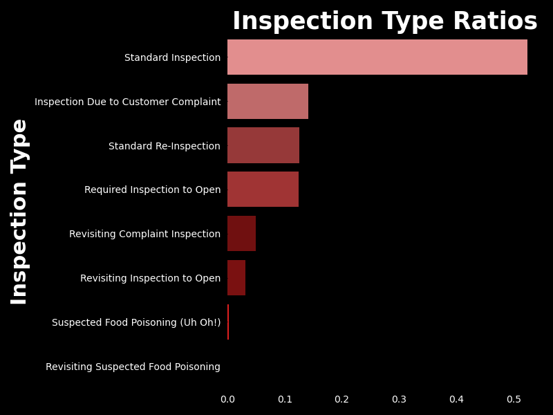
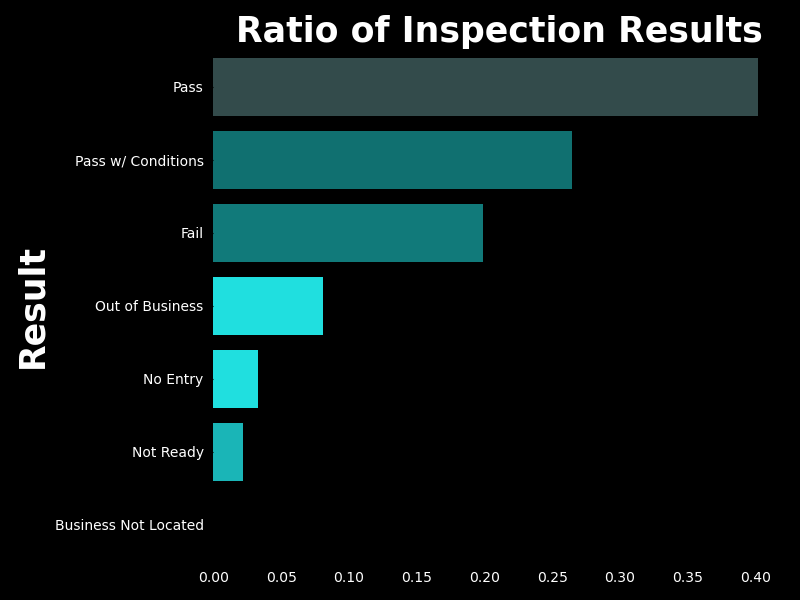
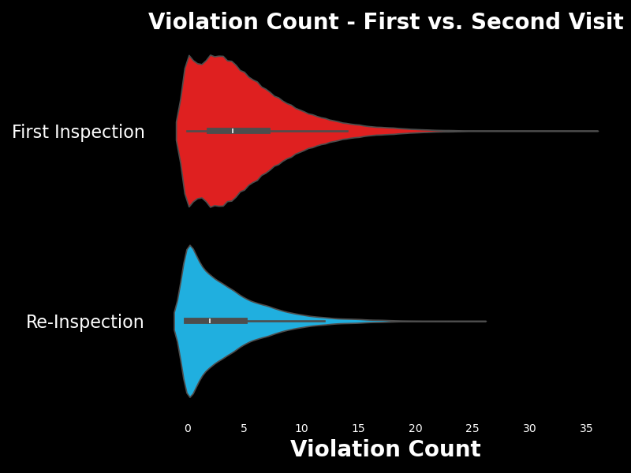
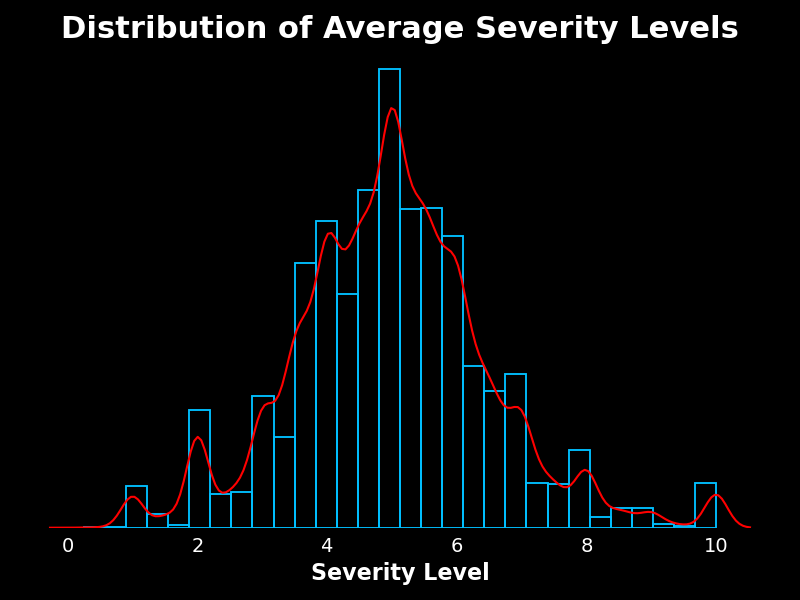
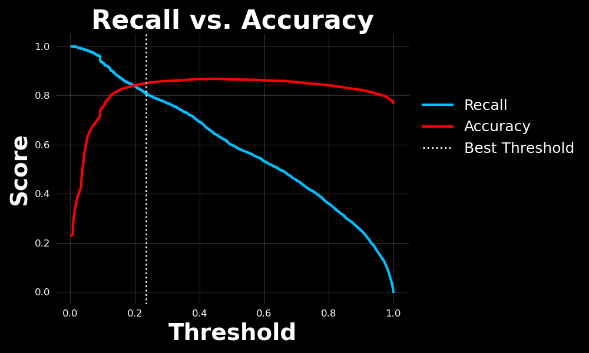

# 
# Food Inspections for the Ordinary
###  The Problem at Hand

Have you ever observed the letter grade restaurants or coffee shops keep posted on their wall? An **A** would reassure you, and a **B** might raise questions in your mind, but at the end of the day you know the establishment and you trust them. But should you? In my years of experience in the restaurant industry, it is my belief that this single letter is not a sufficient representation of how the restaurant conducts (*or has conducted in the past*) healthy and safe practices.

### Solution
All health departments in the United States keep the record of food inspections for establishments on public record, where all restaurant's prior violations are documented as well as all pertinent info regarding the what type of inspection occurred and how it resulted. But this information is stored in excel sheets or similar formats which is not easily interpretable and has virtually zero searchability.
My job as head of **FiFo** is to visualise the information regarding the inspection track record of an establishment to potential customers in a captivating, easy to digest manner so they can make a better informed decision on where to eat.

**Project Goals:**

1. A Streamlit app which allows users to search for restaurants, select a location, 
and view graphs and summary statistics based on food safety data related to the selected restaurant.

2. A classification model to predict inspection results **(Pass/Fail)**.

### Potential Impact

When outbreaks and recalls break the news cycle, this is when most people know to avoid those products/companies. In this sense the **FiFo** app is a proactive tool which could lower the severity (*affected population*) of foodborne outbreaks by educating the customer base therefore creating potential pushback against visiting risky establishments. With the tools of Data Science I hope to encourage people to make more informed & healthier choices on things which may impact their health and well-being greatly.

# Table of Contents
- [The Problem at Hand](#the-problem-at-hand)
- [Methodology](#methodology)
  - [Exploratory Data Analysis](#exploratory-data-analysis)
  - [Model](#model)
  - [App](#app)
- [Conclusion](#conclusion)
- [Software Requirements](#software-requirements)
- [References](#references)

# Methodology

### [Exploratory Data Analysis](code/notebooks/01_EDA.ipynb)

- [Dataset Source](https://data.cityofchicago.org/Health-Human-Services/Food-Inspections-7-1-2018-Present/qizy-d2wf/about_data)

- [Data Dictionary](https://data.cityofchicago.org/api/views/qizy-d2wf/files/O9cwLJ4wvxQJ2MirxkNzAUCCMQiM31DMzRkckMsKlxc?download=true&filename=foodinspections_description.pdf) (provided by Chicago Data Portal)

In this section, I focus on exploring, cleaning, and visualizing the **Chicago Food Inspections** dataset. The goal is to gain insights while engineering new features to prepare a comprehensive cleaned dataset. These features will support both the app development and subsequent modeling tasks. The process follows a cyclical approach, iterating through exploration, cleaning, and visualization to reflect the iterative nature of the data science workflow.

**Cleaning**

Routine cleaning was done, such as renaming columns, converting data types. I dropped irrelevant rows and columns based on what information was necessary for my project goals. The dataset from the Chicago Health Department was very thorough, requiring minimal handling of missing values and only addressing a handful of data entry errors.

One step performed was mapping the inspection types to definitions more understandable by the layman, *e.g.* `Canvass` to `Standard Inspection`

**Simplification of Inspection Results for Modeling**

To streamline the problem and focus on binary classification, inspection results were simplified to "Pass" or "Fail." I referenced [Chicago.gov](https://www.chicago.gov/city/en/depts/cdph/provdrs/food_safety.html) to make many judgement calls such as this one where I deem a **Pass w/ Conditions** to have virtually the same merits as a straight **Pass**. Non-binary results were excluded from the analysis.

**Feature Engineering**

I leveraged my domain expertise and my Python skills to create new features which were absent from the original dataset. This includes:

-   Parsing detailed violation notes to extract the required information, such as the number of violations.

-   Assigning realistic severity levels to health violations, informed by my 7+ years of experience in the food service industry and handling customer expectations.

These engineered features improve the dataset for both app functionality and deeper insights.

With cleaning and the bulk of preprocessing out of the way, now I can continue towards training a model and developing the **FiFo** app.

---

### [Model](code/notebooks/02_modelling.ipynb)

The objective is to build a binary classification model to predict the outcome of restaurant health inspections **(Pass/Fail)**. **Logistic regression** was chosen for its interpretability, allowing restaurant owners to understand the factors influencing inspection outcomes. The model is optimized for **recall** to minimize the risk of missing critical inspection failures.

**Class Balance**

I have chosen `Fail` as our **positive class** because  our features are health codes which were broken, so it would make more intuitive sense to have my coefficients be interpretable as *'Breaking this code makes you this % more likely to fail'* in order to place emphasis on the major health codes to avoid breaking. And, much like a medical diagnosis or fraud detection, the positive class is not necessarily always a good thing.

**Pipeline Setup**

- The pipeline included a **standard scaler**, **one-hot encoder**, and **logistic regression** to ensure interpretability.

- `GridSearchCV` was used for hyperparameter tuning.

The first iteration achieved high **accuracy** but suffered from low **recall**, resulting in too many false negatives.

Subsequent iterations introduced threshold tuning, taking advantage of `predict_proba()` to balance **recall** and **precision**, ultimately improving the **F1 score** and significantly reducing false negatives.

The final iteration optimized thresholds to ensure **accuracy** remained above 85% while enhancing **recall**.

**Model Conclusion**

Results were more promising than expected, but I would like to obtain a higher **accuracy** while still optimizing for **recall** before recommending this model for anything practical. There are several important issues that I would like to address before working on this model further, for example: 
 - Preprocessing challenges led to some less than ideal code in order to properly encode the features.
 - Logistic regression was chosen for its interpretability, but assumptions about the dataset, such as **independence of observations** and **multicollinearity**, highlighted the need for cautious interpretation.
 - More data/better features, as I gain more mastery of these inspection data sets I will better understand the most optimal pieces of information to extract/engineer in order to train my model better.

---

### App

**Instructions for running `app_demo.py`**

1. Make sure you have executed all code in `01_eda` in order for the processed data to be properly saved to the `data/` folder as `processed_chicago.csv`. Change file paths at your own discretion, as long as it matches with the source code of `app_demo.py`.
2. Ensure you have installed all required packages listed in **Software Requirements**.
3. With your terminal in the main directory of this project folder, run this line of code:
	`streamlit run app_demo.py`

---

# Conclusion

**App Development**

One of the main skills as a data scientist is being able to visualise information, and while I have been working on that throughout the entirety of the GA bootcamp, full on app design is a whole other beast. My greatest learning experience in this process was understanding how all facets of code work together to create a final product that, if it works, is truly a beautiful thing. Beginning work on this app has opened up a universe of new ideas and also helped me greatly to understand how I must refactor my code/projects so that I can keep up once the complexity of a program grows to real world scale.

**Model**

I went into the modelling stage with low expectations and was pleasantly surprised by the performance. I enjoyed manipulating the thresholds of my logistic regression classification and seeing how that affects the performance, although it seems intuitive, it was nice to have more practice with it. I am displeased however by the hacky methods I used in order to get my features encoded properly due to the way I set up the dataframe in the first place. While there may have been a better way to do it, I did not have the time to discover that, although I have a few ideas...

**Moving Forward**

- For time reasons, in this project I only took advantage of the violation codes, for my app I would like to evaluate the entirety of these entries (especially the `Comments` section) and display key words such as type of rodents found and type of contaminations.

- I chose the Chicago dataset as its information is the perfect level of thoroughness without requiring too much cleaning and reorganization considering the limited timeframe of this capstone project. In the future steps of this project, I must explore how to aggregate multiple cities' restaurant inspection info through varied data collection methods in order to generalize this data for the purposes of scaling my app across many regions and to obtain more data for my model.

- Not only could the results of this project be scaled to work for multiple cities, I would also like to cover other types of establishments such as hotels, housing units, swimming pools, and many more. 

- Due the list-like nature of my engineered columns such as `violation_codes`, it posed a syntactical challenge in trying to get this feature matrix in the right shape and format to be used in `sklearn`'s models and `seaborn`'s plots. I discovered many new `pandas` methods but I just did not have mastery of the library to fully take advantage of them, and at that point I had already done too much work to start over and reformat my desired columns. Hindsight is 20/20, after having run into these issues during the modelling and app phases of my project I realize I probably should have created my features in a much different way. For the time being I tried whatever solutions I could think of in order to keep the project moving forward. This was a very interesting problem that, while definitely frustrating, I think was important for me to experience. Learning from this problem specifically is my main takeaway from the project. As a data scientist, we must gain full mastery of data manipulation and reshaping before successfully moving on to other steps such as modelling and visualisations, and for me this problem was the best representation of why that is so important.

# Software Requirements
- Python (3.8.20)
- Pandas (2.0.3)
- NumPy (1.24.3)
- Matplotlib (3.7.2)
- Seaborn (0.13.2)
- Scikit-learn (1.3.0)
- Streamlit (1.40.1)

**Data Set Download Instructions:**

1. Click this [link](https://data.cityofchicago.org/Health-Human-Services/Food-Inspections-7-1-2018-Present/qizy-d2wf/about_data) for the dataset (`Food Inspections - 7/1/2018 - Present`)

2. Click `Export` in the upper right hand corner.

3. Ensure export format is `CSV` and click download.

4. Place the downloaded CSV file in the `data/` folder of this repo.

*Attention:* Before running `app_demo.py` the dataset must be read, processed, and exported to the `data/` folder via the code cells in the `01_EDA` notebook.

---

# References
[Health Code Requirements](https://www.chicago.gov/city/en/depts/cdph/provdrs/food_safety/svcs/understand_healthcoderequirementsforfoodestablishments.html)

[Rules and Regulations](https://www.chicago.gov/dam/city/depts/cdph/food_env/general/REGSSelfCertPilotdraftposting321.pdf)
